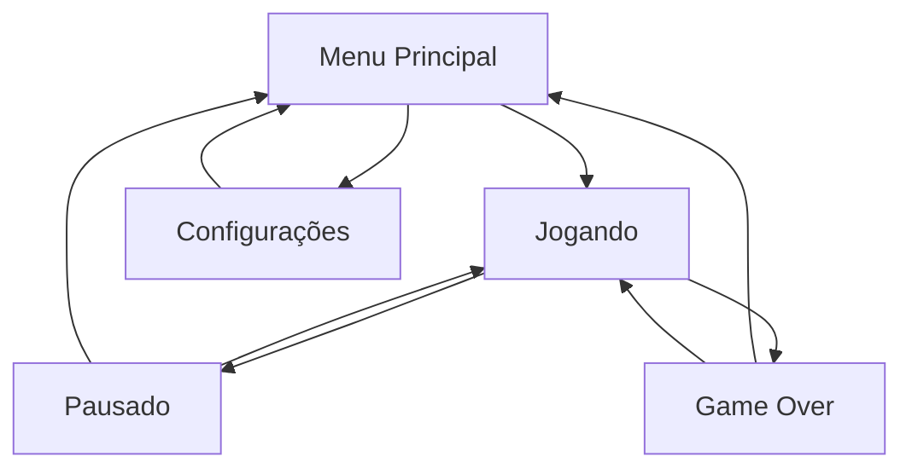

# 🎮 Megaman X Runner

<div align="center">


**Um jogo de corrida infinita inspirado em Megaman X, criado com Python e Pygame**

</div>

---

## 🎯 Objetivo

**Megaman X Runner** é um jogo de corrida infinita (endless runner) onde você controla o Megaman X em uma corrida sem fim através de uma floresta cyberpunk. O objetivo é **sobreviver o máximo de tempo possível** enquanto:

- 🏃‍♂️ **Corre automaticamente** pela fase
- 🔫 **Atira nos inimigos** que aparecem pelo caminho
- 🛡️ **Coleta power-ups** para se fortalecer
- 📏 **Alcança a maior distância possível**

### 🎮 Mecânicas Principais

| Mecânica | Descrição |
|----------|-----------|
| **Corrida Automática** | O jogador se move automaticamente para a direita |
| **Combate** | Atire nos inimigos para destruí-los e ganhar pontos |
| **Power-ups** | Colete escudos, vida e tiro rápido |
| **Sistema de Vida** | 16 pontos de vida, com regeneração via power-ups |
| **Dificuldade Progressiva** | Inimigos ficam mais frequentes com o tempo |

---

## 🚀 Como Jogar

### 🎮 Controles Padrão

| Tecla | Ação |
|-------|------|
| `←` / `→` | **Mover** esquerda/direita |
| `Z` | **Pular** |
| `X` | **Dash** (movimento rápido) |
| `A` | **Atirar** |
| `ESC` | **Pausar** |

### 🛡️ Power-ups Disponíveis

| Power-up | Efeito | Duração |
|----------|--------|---------|
| **❤️ Vida** | Restaura 4 pontos de vida | Instantâneo |
| **🛡️ Escudo** | Protege contra 1 hit de inimigo | 15 segundos |
| **⚡ Tiro Rápido** | Aumenta velocidade de disparo | 10 segundos |

### 🎯 Estratégias

- **Mantenha-se em movimento**: Use dash para escapar de situações perigosas
- **Colete power-ups**: Especialmente escudos antes de áreas com muitos inimigos
- **Mire bem**: Projéteis de inimigos vêm em alturas diferentes
- **Use o terreno**: Pule para evitar projéteis baixos

---

## 💾 Instalação

### 🔧 Requisitos

- **Python 3.9+** 
- **Pygame 2.6.1+**
- **Windows/Linux/macOS**

### 📥 Opção 1: Executável (Recomendado)

1. Baixe o arquivo `Megaman_X_Runner.exe`
2. Execute diretamente - não precisa instalar Python!

### 📥 Opção 2: Código Fonte

```bash
# Clone o repositório
git clone https://github.com/seu-usuario/pygame_mmx_fangame.git
cd pygame_mmx_fangame

# Instale as dependências
pip install pygame

# Execute o jogo
python main.py
```

### 🔨 Compilar Executável

```bash
# Instale PyInstaller
pip install pyinstaller

# Compile o jogo
pyinstaller Megaman_X_Runner.spec

# Executável estará em dist/
```

---

## 🏗️ Arquitetura do Código

O projeto foi desenvolvido seguindo princípios de **programação orientada a objetos** e **separação de responsabilidades**:

### 📁 Estrutura de Pastas

```
pygame_mmx_fangame/
├── 📁 assets/                  # Recursos do jogo
│   ├── backgrounds/            # Imagens de fundo
│   ├── sound-effects/          # Efeitos sonoros
│   └── spritesheets/           # Sprites dos personagens
├── 📁 config/                  # Configurações
│   ├── settings.py             # Configurações globais
│   └── key_config.py           # Configurações de teclas
├── 📁 core/                    # Núcleo do jogo
│   ├── game.py                 # Classe principal do jogo
│   ├── game_states.py          # Gerenciamento de estados
│   └── settings_screen.py      # Tela de configurações
├── 📁 entities/                # Entidades do jogo
│   ├── player.py               # Jogador (Megaman X)
│   ├── enemies.py              # Inimigos e IA
│   ├── projectile.py           # Projéteis
│   └── powerups.py             # Power-ups
├── 📁 graphics/                # Sistema gráfico
│   ├── camera.py               # Câmera 2D
│   └── renderer.py             # Renderização
├── 📁 utils/                   # Utilitários
│   └── sprite_loader.py        # Carregamento de sprites
└── main.py                     # Ponto de entrada
```

### 🧩 Componentes Principais

#### 🎮 **Core (core/)**
- **`Game`**: Classe principal que orquestra todo o jogo
- **`StateManager`**: Gerencia estados (Menu, Jogando, Pausado, Game Over)
- **`SettingsScreen`**: Interface para configurar controles

#### 👾 **Entities (entities/)**
- **`Player`**: Megaman X com física, animações e habilidades
- **`Enemy`**: Inimigos com IA e sistema de tiro
- **`EnemyManager`**: Spawning e gerenciamento de inimigos
- **`PowerUp`**: Sistema de power-ups coletáveis
- **`Projectile`**: Projéteis do jogador e inimigos

#### 🎨 **Graphics (graphics/)**
- **`Camera`**: Sistema de câmera com seguimento suave
- **`GameRenderer`**: Renderização otimizada de todos elementos

#### ⚙️ **Config (config/)**
- **`settings.py`**: Configurações globais (resolução, física, cores)
- **`key_config.py`**: Sistema de configuração de teclas personalizáveis

### 🔄 Fluxo de Estados



### 🎯 Padrões Utilizados

- **State Pattern**: Para gerenciamento de estados do jogo
- **Component Pattern**: Entidades com comportamentos modulares
- **Observer Pattern**: Sistema de eventos e colisões
- **Singleton Pattern**: Configurações globais e managers

---

## 🎨 Assets e Recursos

### 🖼️ **Gráficos**

| Asset | Descrição | Formato |
|-------|-----------|---------|
| **Player Sprites** | Animações do Megaman X | PNG Spritesheet |
| **Enemy Sprites** | Sprites dos inimigos | PNG Spritesheet |
| **Background** | Floresta cyberpunk paralax | PNG |
| **Projectiles** | Projéteis e efeitos | PNG |
| **Power-ups** | Ícones de power-ups | PNG |

### 🔊 **Áudio**

| Som | Uso | Formato |
|-----|-----|---------|
| **Tiro do Jogador** | Feedback de disparo | WAV |
| **Tiro do Inimigo** | Disparo de inimigos | WAV |
| **Coleta de Item** | Power-ups coletados | WAV |
| **Dano** | Jogador toma dano | WAV |
| **Morte** | Game over | WAV |

### 🎨 **Sistema de Sprites**

O jogo utiliza **spritesheets** para otimizar o carregamento:

```python
# Exemplo de carregamento de sprite
sprite_rect = (x, y, width, height)  # Coordenadas no spritesheet
sprite = spritesheet.subsurface(sprite_rect)
sprite = pygame.transform.scale(sprite, (width * SCALE, height * SCALE))
```

---

## ⚡ Sistemas Técnicos

### 🎯 **Sistema de Física**

```python
# Gravidade e movimento
GRAVITY = 0.6
JUMP_VELOCITY = -12
PLAYER_SPEED = 5.0
```

- **Gravidade realista**: Simulação de queda natural
- **Pulo responsivo**: Controle preciso de salto
- **Colisões pixel-perfect**: Detecção precisa de colisões

### 🎮 **Sistema de Input**

- **Configurável**: Todas as teclas podem ser remapeadas
- **Responsivo**: Input buffer para comandos precisos
- **Feedback visual**: Indicação clara de ações

### 🎨 **Sistema de Renderização**

- **Renderização em camadas**: Background → Entidades → UI
- **Efeitos visuais**: Piscamento de dano, escudo brilhante
- **Otimização**: Culling de objetos fora da tela

### 💾 **Sistema de Persistência**

```json
// config/controls.json
{
  "move_left": 276,
  "move_right": 275,
  "jump": 122,
  "dash": 120,
  "shoot": 97,
  "pause": 27
}
```

---

## 🎮 Características Técnicas

### ✨ **Destaques**

- 🎯 **60 FPS consistentes** com delta time
- 🔄 **Parallax scrolling** no background
- 🎨 **Animações fluidas** com sprite frames
- 🔊 **Sistema de áudio** completo
- ⚙️ **Configurações persistentes** 
- 🛡️ **Sistema de power-ups** balanceado
- 🤖 **IA dos inimigos** com comportamentos variados

### 📊 **Performance**

- **Otimização de sprites**: Carregamento único na inicialização
- **Culling inteligente**: Objetos fora da tela são pausados
- **Memory management**: Limpeza automática de objetos
- **Delta time**: Frame rate independente

### 🔧 **Configurabilidade**

- ⌨️ **Controles customizáveis**
- 🎚️ **Dificuldade ajustável** (via código)
- 🎨 **Temas modificáveis** (cores e sprites)
- 🔊 **Volume independente** para efeitos

---

## 🏆 Créditos

### 👨‍💻 **Desenvolvimento**
- **John Lucas** - Programação, Design e Arte

### 🎮 **Inspiração**
- **Capcom** - Série Megaman X original
- **Comunidade Pygame** - Recursos e tutoriais

### 🛠️ **Ferramentas Utilizadas**
- **Python 3.9** - Linguagem principal
- **Pygame 2.6.1** - Engine de jogos
- **PyInstaller** - Compilação de executável
- **VS Code** - IDE de desenvolvimento

---

### 🤝 **Contribuições**

Contribuições são bem-vindas! Sinta-se livre para:

1. 🍴 **Fork** o projeto
2. 🌟 **Criar** uma feature branch
3. 📝 **Commit** suas mudanças
4. 📤 **Push** para a branch
5. 🔄 **Abrir** um Pull Request

---

<div align="center">

### 🎮 **Divirta-se jogando Megaman X Runner!** 🎮

</div>
